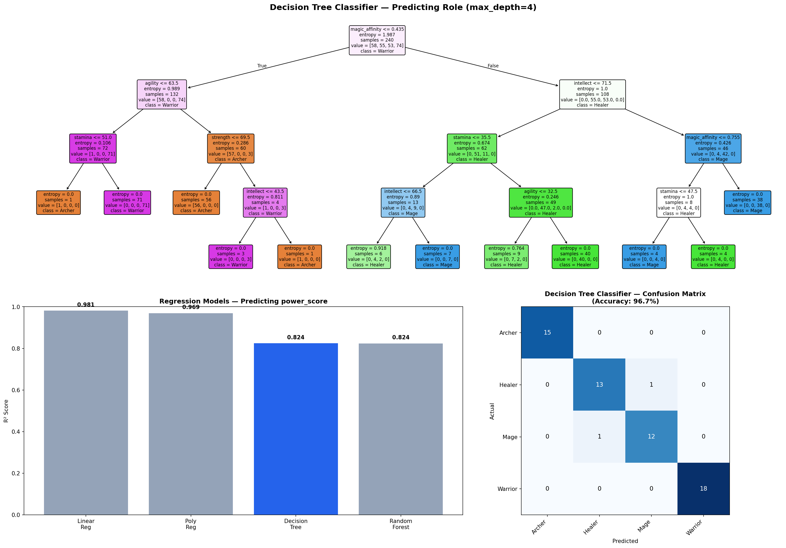

# 🎮 Game Characters — Power Score & Role Prediction

Machine learning project that models a synthetic RPG character dataset — predicting a character's **`power_score`** (regression) and **`role`** (multi-class classification) from their stats, then comparing multiple algorithms including **Decision Trees**.


---

## 📌 Overview

Each row in the dataset represents an RPG character defined by its race and core stats. The project walks through a full mini ML pipeline:

- 🧹 Preprocessing — label encoding, one-hot encoding, feature scaling
- 📈 **Regression** — predicting `power_score` from character stats
- 🧠 **Multi-class classification** — predicting `role` (`Warrior` / `Archer` / `Healer` / `Mage`)
- 🌳 **Decision Trees** (regressor + classifier) benchmarked against Linear/Polynomial Regression, Logistic Regression, and Random Forest
- 📊 Exploratory analysis — average power by race, dominant stat per role, feature importance

---

## 🗂️ Dataset

**`game_characters.csv`** — 300 rows × 10 columns

| Column | Type | Description |
|---|---|---|
| `race` | categorical | `Dragon`, `Dwarf`, `Elf`, `Human`, `Orc` |
| `level` | int | Character level |
| `strength` | int | Physical power stat |
| `agility` | int | Speed / dexterity stat |
| `intellect` | int | Magical/mental stat |
| `stamina` | int | Endurance stat |
| `magic_affinity` | float (0–1) | Affinity for magic |
| `years_training` | int | Years of training |
| `power_score` | float | **Regression target** |
| `role` | categorical | **Classification target** — `Warrior`, `Archer`, `Healer`, `Mage` |

---

## 🌳 Decision Tree Results

<p align="center">
  
</p>

The figure above shows: the trained **Decision Tree Classifier** structure (predicting `role`, `max_depth=4`), an **R² comparison** across regression models predicting `power_score`, and the classifier's **confusion matrix** on the test set.

### 📈 Regression — predicting `power_score`

| Model | R² Score |
|---|---|
| Linear Regression | **0.981** |
| Polynomial Regression (deg=2) | 0.969 |
| Decision Tree Regressor (max_depth=4) | 0.824 |
| Random Forest Regressor | 0.824 |

`power_score` turns out to be a near-linear combination of the stats, so linear models edge out the tree-based models here — the depth-limited Decision Tree still explains ~82% of the variance.

### 🧠 Classification — predicting `role`

| Model | Accuracy |
|---|---|
| **Decision Tree Classifier (max_depth=4, entropy)** | **96.7%** |
| Logistic Regression | 95.0% |

**Decision Tree Classifier — per-class performance:**

| Role | Precision | Recall | F1-score |
|---|---|---|---|
| Archer | 1.00 | 1.00 | 1.00 |
| Healer | 0.93 | 0.93 | 0.93 |
| Mage | 0.92 | 0.92 | 0.92 |
| Warrior | 1.00 | 1.00 | 1.00 |

**🔑 Feature importance (what the tree splits on):**

| Feature | Importance |
|---|---|
| `magic_affinity` | 0.538 |
| `agility` | 0.239 |
| `intellect` | 0.120 |
| `stamina` | 0.073 |
| `strength` | 0.030 |
| `level`, `years_training`, `race_*` | 0.000 |

`magic_affinity` and `agility` alone account for ~78% of the tree's decision-making — a character's role is driven almost entirely by their stat profile, not their race or level.

---

## 🛠️ Tech Stack

- **Python** — pandas, numpy
- **scikit-learn** — `DecisionTreeRegressor`, `DecisionTreeClassifier`, `LinearRegression`, `LogisticRegression`, `RandomForestRegressor`, `PolynomialFeatures`, `StandardScaler`, `LabelEncoder`
- **matplotlib / seaborn** — visualizations (tree plots, confusion matrix, heatmaps)

---

## 🚀 Getting Started

```bash
git clone https://github.com/Eng3mr5aled/<repo-name>.git
cd <repo-name>
pip install pandas numpy matplotlib seaborn scikit-learn
```

Run the notebook/script:

```bash
python mid_project.py
```

---

## 📁 Project Structure

```
.
├── game_characters.csv          # dataset (300 characters × 10 features)
├── mid_project.py               # full analysis pipeline
├── decision_tree_results.png    # decision tree results figure
└── README.md
```

---

## 📊 Pipeline Summary

1. **Preprocessing** — `LabelEncoder` for `race`, `StandardScaler` for numerical features
2. **Task 1–2** — Encoding + scaling sanity checks
3. **Task 3** — Regression: Linear vs Polynomial vs Decision Tree vs Random Forest → predicting `power_score`
4. **Task 4** — Classification: Logistic Regression vs Decision Tree → predicting `role`, with confusion matrix + classification report
5. **Task 5** — Analysis: average `power_score` by race, dominant stat per role (z-score normalized heatmap), overall feature importance

---

## ✍️ Author

**Amr Khaled Sedik** — Computer & Control Systems Engineering, Ain Shams University
[GitHub: Eng3mr5aled](https://github.com/Eng3mr5aled)
